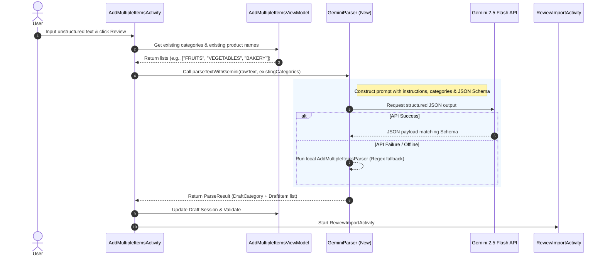

# Implementation Plan: AI-Powered Smart Mode (Gemini 2.5 Flash)

This document outlines the detailed implementation plan to replace the regex-based **Fast Mode** with an AI-powered **Smart Mode** in the **Presyohan Mobile** Android application. The core engine will use **Gemini 2.5 Flash** to achieve highly accurate parsing of item lists and semantic category classification.

---

## 1. Overview & Objectives

*   **Goal**: Replace the rigid "Fast Mode" with a flexible "Smart Mode" powered by the Gemini 2.5 Flash model.
*   **Intelligent Parsing**: Parse raw, semi-structured, or unstructured text input (e.g., pasted supplier invoices, pricelists, message logs) to extract item names, descriptions, prices, units, and categories.
*   **Semantic Categorization**: If the user's input does not explicitly define a category header, the system will supply the list of existing categories for the current store. Gemini will determine the best matching category.
*   **Validation & Invalid Item Flagging**: If the input line is gibberish or unparseable, label it as invalid so it can be flagged during the review phase.
*   **Fallback Reliability**: If the Gemini API call fails (network issues, API key issues, quota limits), gracefully degrade to the existing regex-based parser so the user experience is not disrupted.

---

## 2. Current Architecture vs. Proposed Smart Mode

Currently, when in Fast Mode, the application uses regex patterns in `AddMultipleItemsParser.kt` to extract categories and items line-by-line.

### Current Limitations:
1.  **Format Rigidity**: It relies on strict syntax delimiters (`-`, `—`, `|`, `₱`) and bracket headers (`[Fruits]`). Slight deviations or spacing anomalies cause validation errors.
2.  **Lack of Category Association**: If category headers are missing, all items are lumped under `UNCATEGORIZED`, forcing the user to manually categorize them in Simple Mode.
3.  **No Semantic Parsing**: Cannot extract description or units unless they follow precise bracket/pipe formats.

### Proposed AI-Powered Flow:


---

## 3. Detailed Technical Design

### A. Dependency Configuration
We will add the official Google Generative AI SDK to the project.
*   **Library**: `com.google.ai.client.generativeai:generativeai:0.9.0` (or stable version suited for compileSdk 35 / Java 11).
*   Added in `app/build.gradle.kts` and registered in `gradle/libs.versions.toml`.

### B. Safe API Key Configuration
We will allow configuring the `GEMINI_API_KEY` locally using `local.properties` to avoid exposing the credential in version control.
1.  Add `GEMINI_API_KEY=AIzaSy...` inside `local.properties`.
2.  Read the property in `app/build.gradle.kts` and inject it into `BuildConfig`:
    ```kotlin
    val geminiApiKey = project.findProperty("GEMINI_API_KEY") as? String ?: System.getenv("GEMINI_API_KEY") ?: ""
    defaultConfig {
        buildConfigField("String", "GEMINI_API_KEY", "\"$geminiApiKey\"")
    }
    ```

### C. Prompt Design & Structured JSON Output
To ensure that Gemini 2.5 Flash returns exact data structured for Kotlin serialization, we will configure the model for JSON response (`responseMimeType = "application/json"`) and send a highly descriptive system prompt.

#### Prompt Template:
```text
You are an expert data parsing assistant for "Presyohan", a price tracking app.
Your task is to parse a raw text pricelist/supplier message and convert it into a structured JSON object.

Input Text to parse:
"""
{USER_INPUT}
"""

List of Existing Categories in this Store:
{EXISTING_CATEGORIES_LIST}

Instructions:
1. Parse the input text line-by-line or section-by-section to extract items.
2. For each item, extract:
   - productName (e.g., "Fuji Apple", "Fresh Milk 1L")
   - description (extra details like brand, packaging type, flavor, size. If none, null)
   - unit (default to "1pc" if not explicitly specified. Examples: "kg", "bottle", "pack", "stick", "can")
   - price (numeric price, e.g. 150.00. Null if no price is specified)
   - priceText (raw price text found, e.g. "₱150", "99.50")
   - isValid (set to true for valid items; set to false if the line is gibberish, incomplete, or not a product entry)
   - originalLine (the exact text line(s) this item was parsed from)
3. Determine Categories:
   - If the input text contains explicit category headers (e.g., "[Beverages]", "Snacks:", "Fruits Section"), group items under that category name.
   - If there are NO category headers, or for items that appear outside headers:
     - Compare the item against the provided "List of Existing Categories".
     - Semantically map the item to the best-fitting existing category (e.g., "Fresh Milk" -> "DAIRY").
     - If it does not map to any existing category, group it under a logical new category name.
   - If the item is invalid (isValid is false), place it under a category named "UNCATEGORIZED".

Return ONLY a JSON object matching this schema:
{
  "categories": [
    {
      "name": "string (uppercase category name)",
      "items": [
        {
          "productName": "string",
          "description": "string or null",
          "unit": "string",
          "price": number or null,
          "priceText": "string",
          "isValid": boolean,
          "originalLine": "string"
        }
      ]
    }
  ]
}
```

### D. Data Serialization Classes
We will introduce lightweight DTOs in a new file `GeminiParser.kt` to decode the response safely:
```kotlin
@Serializable
data class GeminiParsedItem(
    val productName: String,
    val description: String? = null,
    val unit: String = "1pc",
    val price: Double? = null,
    val priceText: String = "",
    val isValid: Boolean = true,
    val originalLine: String? = null
)

@Serializable
data class GeminiParsedCategory(
    val name: String,
    val items: List<GeminiParsedItem>
)

@Serializable
data class GeminiParseResponse(
    val categories: List<GeminiParsedCategory>
)
```

---

## 4. UI/UX & Codebase Refactoring Plan

### A. Rename UI Labels & Identifiers
*   `activity_add_multiple_items.xml`:
    *   Change toggle button text (`btnToggleMode`) default from `"Fast Mode"` to `"Smart Mode"`.
    *   Change header title `tvSubHeaderTitle` fallback / default text.
    *   Update `tvFormatTitle` to say: `"Smart Format Info"` or `"AI Powered Parsing"`.
    *   Update the guide card text `tvFormatContent` to explain that the user can paste any text format (even without categories) and the AI will auto-categorize it using the store's current categories.
*   `AddMultipleItemsActivity.kt`:
    *   Rename internal `EntryMode.FAST` to `EntryMode.SMART` (optional or keep internally, but update the user-facing text references).
    *   Rename methods: `performPreviewFastMode()` -> `performPreviewSmartMode()`.

### B. Implement `GeminiParser.kt`
Create a helper singleton class `GeminiParser`:
*   Function: `suspend fun parseText(rawText: String, existingCategories: List<String>, existingProductNames: Set<String>): ParseResult`
*   Initialize `GenerativeModel` using `"gemini-2.5-flash"` and `BuildConfig.GEMINI_API_KEY`.
*   Handle JSON parsing and map to `DraftCategory` and `DraftItem` structures.
*   **Validation Mapping**:
    *   If `isValid` is false, add `ValidationError.INVALID_FORMAT` to the item's validation errors list.
    *   If `price` is null or invalid, add `ValidationError.INVALID_PRICE`.
    *   If the category is `"UNCATEGORIZED"`, add `ValidationError.MISSING_CATEGORY`.

### C. Graceful Fallback Logic
In `AddMultipleItemsActivity.kt`'s `performPreviewSmartMode()`:
```kotlin
lifecycleScope.launch {
    var parseResult: ParseResult? = null
    var fallbackUsed = false
    
    if (BuildConfig.GEMINI_API_KEY.isNotBlank()) {
        try {
            parseResult = GeminiParser.parseText(raw, existingCategories, existingProducts)
        } catch (e: Exception) {
            // Log warning, flag fallback
            fallbackUsed = true
        }
    } else {
        fallbackUsed = true
    }

    if (fallbackUsed || parseResult == null) {
        // Fallback to local regex-based parser
        parseResult = AddMultipleItemsParser.parseTextToResult(raw, existingProducts)
        withContext(Dispatchers.Main) {
            Toast.makeText(this@AddMultipleItemsActivity, "AI Parser unavailable. Using offline parser.", Toast.LENGTH_SHORT).show()
        }
    }
    
    // Proceed with validating session & loading ReviewImportActivity
}
```

---

## 5. Summary of Code Files to Be Created/Modified

| File Path | Description of Edits |
| :--- | :--- |
| `gradle/libs.versions.toml` | Add Google Generative AI dependency coordinates. |
| `app/build.gradle.kts` | Add implementation dependency & inject `GEMINI_API_KEY` into `BuildConfig`. |
| `local.properties` | Add local placeholder for the `GEMINI_API_KEY`. |
| `app/src/main/res/layout/activity_add_multiple_items.xml` | Modify text views, guides, and buttons to reference "Smart Mode" & explain AI features. |
| `app/src/main/java/com/presyohan/app/ItemImportModels.kt` | Update `EntryMode` enum from `FAST` to `SMART` (if doing clean renaming) and `ImportSource`. |
| `app/src/main/java/com/presyohan/app/GeminiParser.kt` | **New File**. Handles generative AI interaction, prompt crafting, and response decoding. |
| `app/src/main/java/com/presyohan/app/AddMultipleItemsActivity.kt` | Wire the AI parsing execution inside the review trigger, fetch store categories, and implement the fallback warning. |
| `app/src/test/java/com/presyohan/app/AddMultipleItemsParserTest.kt` | Adjust test assertions if enum/import sources were renamed. |

---

## 6. Open Questions for the USER

Before proceeding with the code edits, please let me know your thoughts on the following:
1.  **API Key Management**: Does exposing `GEMINI_API_KEY` through `local.properties` + `BuildConfig` work for you, or is there another preferred method of passing the key?
2.  **Fallback Message**: When the Gemini API fails or no API key is set, is displaying a Toast indicating `"AI Parser unavailable. Using offline parser."` appropriate, or would you prefer a different fallback experience?
3.  **Renaming Enums**: Would you like me to fully rename `EntryMode.FAST` to `EntryMode.SMART` and `ImportSource.FAST_TEXT` to `ImportSource.SMART_TEXT` across the codebase, or keep the existing enum values unchanged internally to minimize diffs?
